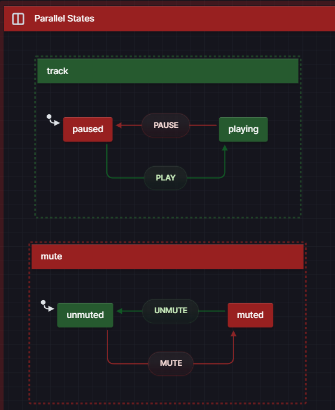

# XState Tutorials Project

This project contains various XState State Machines on various concepts. Each 
state machine has a section in App.tsx that corresponds to that machine. This project
followed closely to [xstateforreactdevelopers.com](xstateforreactdevelopers.com) tutorial

## Concepts include...  
### 1) Basic XState Setup 
Files on demonstrating this concept:  
* onOffMachine.ts  
#### 3 Key Concepts to State Machines
* State → The status or condition of a machine at a given time
* Event → A signal that tells a machine something happened (ex: a button being clicked, a file being loaded)
* Transition → A rule that defines WHEN and HOW a machine can change from 1 state to another. It ensures you can only move between states in predefined ways.
### 2) Compound (Parent/Child --> Hierarchial) States
Files on demonstrating this concept:  
* compoundStatesMachine.ts
* coffeeMachine.ts
#### Compound States
* Are states that contain other states, which can have their own nested states and so on, leading to a hierarchial structuring  

### 3) Parallel States
Files on demonstrating this concept:  
* mediaPlayerMachine.ts
* thermostatMachine.ts

#### Parallel States
* Are states used to model  concurrent behavior in a state machine allowing multiple states to exist independently of each other.
* For example, a media player might have a "track" state that represents the current track being played and a "mute" state that represents if the track is being muted.
* Set type to "parallel" in your state machine

### 4) History States
Files on demonstrating this concept:  
* subscriptionMachine.ts

#### History States
* A history state is a special type of that <strong>remembers</strong> the last active state within a compound state. This allows you to <strong>resume</strong> where your left off when re-enetering a compound state
* Set type to "history" in your state machine
* For a 'Deep History' State, set the type to "deep" inside your hist state

### 5) Context
Files on demonstrating this concept:  
* subscriptionMachine.ts
* volumeMachine.ts

#### Adding Context
* We use state to store <strong>finite</strong> state. We use context to store <strong>infinite</strong> state
* Finite State = a predifined set of states that a machine can be in
* Infinite State = a state that has too many possible values to predefine. For example, the current volume in a music player
